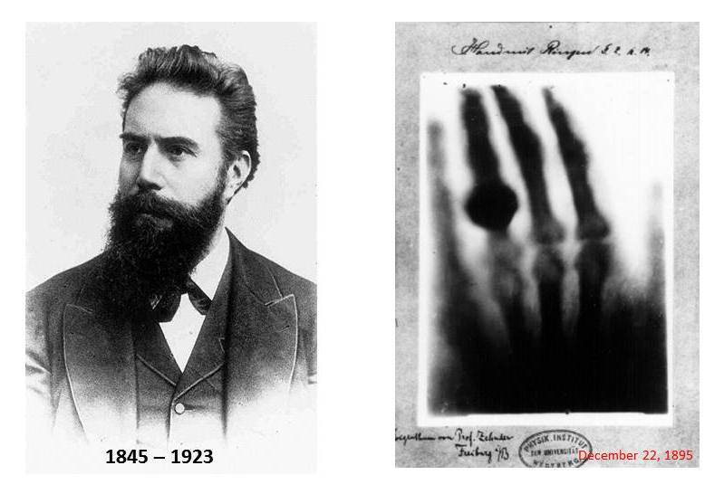
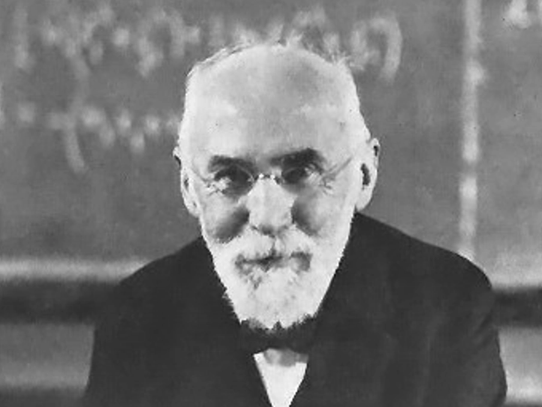

# 第1章 1900年的物理学
##### 作者：【英】Brian Pippard

1900年前后，大部分物理学家依然在封闭的圈子里工作，只有一些零散的令人兴奋的物理学事件会在大众中传播开来，典型的如1895年Rontgen发现X射线。

 

 伦琴（德国），人类历史上第一张X光片，摄于1895年12月22日。

 ### 领先的德国物理学

 德国的物理学如同几乎所有其他学科一样，当时在世界上领先。

 1799年创刊的德国《物理和化学年鉴》（后改名为《物理年鉴》）成为当时的首要物理学杂志，它所包含的优秀论文数目远多于法国《化学与物理年鉴》、英国《哲学杂志》、英国《皇家学会学刊》、英国《哲学汇刊》。 德国把大学当作是新学术的发起者而不仅仅是古老智慧的守护者和阐释者，在这方面德国也引领着世界其他各国。

 从《科学传记辞典》的名单中挑选出那些1900年在世且已经做出成名研究贡献的物理学家，可以得到一幅不同国家对物理学的影响的概略图。符合上述条件的197名物理学家中，67人属于德语系的国家（德国52人，荷兰7人，奥匈帝国6人，瑞士2人），英国35人，法国34人，美国27人，俄国9人，意大利7人，瑞典5人，以及其他8个国家13人。

### 原子和以太
原子（或分子）和以太是19世纪后几十年物理学家全神贯注的两个未解决的问题。

尽管化学结合定律和气体运动论在19世纪末给原子的存在提供了现在看来是无可辩驳的证据，但当时一些很有学术威望的物理学家仍持怀疑观点，如E. Mach等人，他们坚持那些很有影响的实证主义观点。这些人的敌对态度使得原子论者感到沮丧，如著名的气体运动论的伟大先驱L. Boltzmann。随后几年内，对Brown运动的定量研究和X射线衍射的发现使得原子论取得了决定性的胜利。

基于以太的概念，为了对所有关于运动媒介光学的实验结果给出自洽的解释，Lorentz从Maxwell理论出发证明，一个运动的带电导体球产生的电场和磁场图样在高速下受到纵向压缩，需要将球体相应地变形为长短轴比为$\sqrt{1-(v^2/c^2)}$的椭球。在狭义相对论和广义相对论已被广泛接受后，1922年，Lorentz在一次演讲中遗憾地表示：“至于以太，虽然它的概念有一定的好处，但是必须承认，如果Einstein仍然坚持它，他肯定就不会将他的理论给予我们了，因此我们非常感谢他没有因循老路。”

### 熵增定律

热力学的基础早在19世纪40年代和50年代已经奠定，并且在1876-1878年被J. Willard Gibbs以超级的透彻性和想象力应用于化学过程和其他多相系统。热力学第二定律指出，孤立系统熵只能增大或者不变,绝不能减小。

Planck是将熵这个概念看作解决许多问题线索的科学家。虽然Boltzmann在他的H定理中提供了对熵增定律的优美证明，但在Planck看来，那只是这个定律的一个特例而已，热力学这个富有启发性的真理压倒了其他一切概念，第二定律是超越任何具体模型的，甚至也超越了种种原子论理论。

事后看来，我们能够理解熵这个概念的力量，因为Boltzmann的气体理论当然是建立在Newton力学基础上的，熵增定律则在量子世界也同样成立。
作为孤立系统将会变得越来越无序这个基本倾向的严格表述，熵增定律甚至比量子力学规则具有更深厚的普适性。

### 黑体辐射

1860年前后，Kirchhoff解释了Fraunhofer吸收谱线和发射谱线的互补性，这是他对均匀加热空腔中辐射的特性与腔壁的本性无关这个更基本认识的一个推论；如果不是这样，通过让辐射从一个空腔传到另一个温度略高的空腔，就会违反热力学第二定律。

这就清楚地表明辐射的能量密度以及能量在不同波长上的分布，必定完全由腔壁的温度确定。一个物理现象如此干脆地与实物的非本质性质无关，这必须只有从物理世界的基本性质来解释。

温度和辐射强度精确测量技术的发展，为基础科学的研究提供了支持。Planck在推导黑体辐射理论公式时，他得到了与物理实验家惊人一致的结果。

### 近代物理的诞生

在19世纪末的短短几年时间里，物理学作出了四项发现，这四项发现后来证明不仅对物理学而且对整个人类都具有极为重大的意义。它们是：X射线（1895年）、Zeeman效应（1896年）、放射性（1896年）、电子（1897年）。

把1900年Planck提出黑体辐射公式这件事看作近代物理诞生的时刻是很吸引人的，但事实是，Planck公式提出后的至少十年里，它只是被人们当作一个有趣的经验结果，其意义并不明确。只有Einstein在1905-1907年清楚地看出Planck的量子对基础物理学的重要意义，而他的这一洞见也需要若干年后才被人们所知和承认。

物理学在科学中很独特，它是由两种观点培育出来的，有着数学外表现的那种我们可称之为自然哲学，而在实验室里培育的我们称之为实验物理学。物理学的成功靠的是才智和想象力而不是双手的灵巧性。

### 人物插图

 

Ludwig Eduard Boltzmann，奥地利人，1844~1906。

Boltzmann极为赞赏Maxwell富于想象力的见解，并采用其先驱性的统计思想，以描述分子速度分布随时间变化的Boltzmann方程为中心，建立了系统的气体理论。他首先给出熵为无序程度的解释并定量地定义了熵。

 

Hendrik Antoon Lorentz，荷兰人，1853~1928。

Lorentz的电子论借助带电粒子穿过以太的运动对电磁和物质现象给出了全面解释。光由电荷的震动产生，磁场的效应会导致光谱线的Zeeman分裂。他提出了快速运动的带电粒子前方的场的力线缩短的的分析推广，并给出了数学表达式（Lorentz变换）。Loentz变换成为相对论中关于对称性的一个核心概念。
