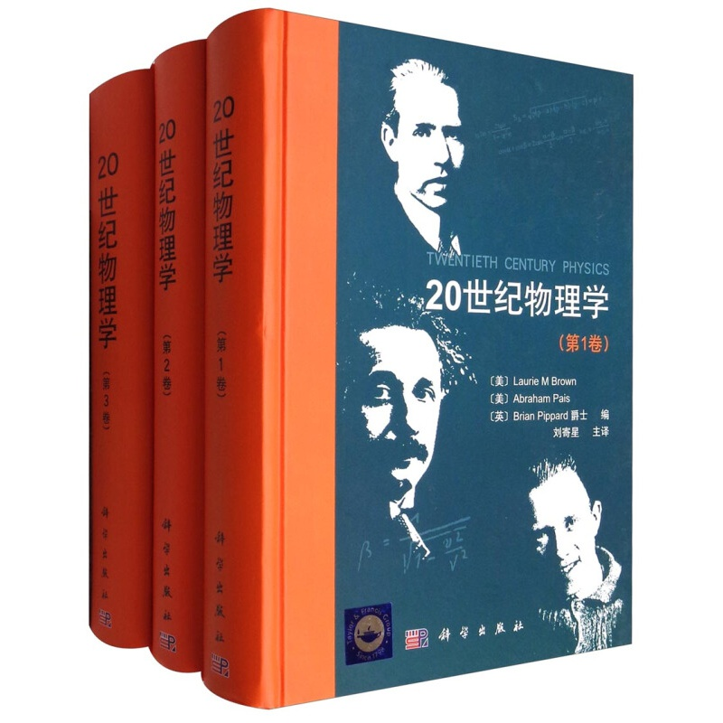

# 三卷本《20世纪物理学》读书摘记
 
 
 
 
 #### 作者：【美】Laurie M Brown，【美】Abraham Pais，【英】Brian Pippard 爵士；
 
 #### 主译：刘寄星

 

### 目录

 <a href="./Chapter1/第1章 1900年的物理学.html" target="_blank">第1章 1900年的物理学</a>

 <a href="./Chapter2/ 第2章 引进原子和原子核 Part1(原子).html" target="_blank"> 第2章 引进原子和原子核 Part1(原子)</a>

